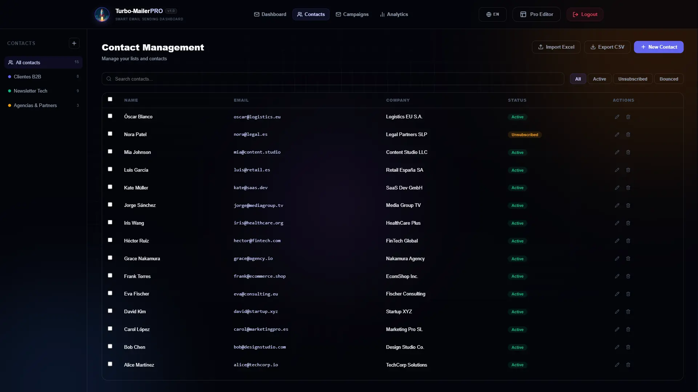
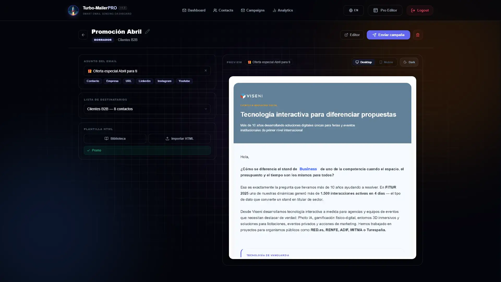

# 🚀 TurboMailer

[](https://www.gnu.org/licenses/agpl-3.0)

**[Versión en Español](README.md)**

**Complete Email Marketing Platform with CRM, HTML Template Editor, AI, Analytics, Tracking, and more.**

TurboMailer is a **self-hosted, single-account application designed for VPS deployment**, built with **Nuxt 3**. It provides full data sovereignty, complete contact and list management, a visual HTML template editor with drag & drop blocks, a campaign system with open and click tracking, real-time analytics, AI copywriting integration, and a multilingual interface (ES/EN). All with SQLite persistence and mass sending via any SMTP service (Gmail, Outlook, Amazon SES, etc.).

## 🛡️ Your Data, Only Yours

As a self-hosted application on your own server:

- **No Intermediaries**: Your contacts' data never leaves your infrastructure.
- **Professional Privacy**: Direct connection between your private instance and your chosen email service.


## 📸 Interface

<table>
  <tr>
    <td></td>
    <td></td>
  </tr>
  <tr>
    <td></td>
    <td></td>
  </tr>
  <tr>
    <td></td>
    <td></td>
  </tr>
  <tr>
    <td></td>
    <td></td>
  </tr>
</table>

---

## ✨ Key Features

### 👥 CRM Contacts

- SQLite database with **full contact details**: email, name, company, phone, LinkedIn, URL, YouTube, Instagram, tags, and status (`active / unsubscribed / bounced`)
- **Distribution list** management with name, description, and customizable color
- Real-time search, filtering by list and status, pagination (50/page), multiple selection, and drag-to-list
- **Bulk import** from Excel (`.xlsx`, `.xls`, `.csv`) with auto-detection of columns
- Full **CSV export** and complete CRUD from the UI

### 📣 Campaign Management

- 4-step wizard: name + subject → list → template → review and send
- Statuses: `draft / scheduled / sending / sent / paused`
- Automatic injection of **tracking pixel** (opens) and **tracked links** (clicks)
- Dynamic variables: `{{Company}}`, `{{Name}}`, `{{URL}}`, `{{Linkedin}}`, `{{Instagram}}`, `{{Youtube}}`
- **Background sending**: overlay auto-dismisses after 4 seconds; send continues without keeping the window open
- **Persistent progress badge**: floating indicator (bottom-right) visible across the whole app with progress bar, pause, and resume buttons
- **Professional retry management**: automatic SMTP-level retries + manual "Retry Failed" button
- **Individual resend**: per-row button to resend specific failed or pending emails

### 📊 Advanced Analytics

- Real-time KPIs: total contacts, campaigns sent, average open and click rates
- **Delivery Funnel**: Sent → Opened → Clicked
- 14-day trend, device distribution (doughnut chart), campaign performance comparison (bar chart)
- Detailed event log with device icons, company, name, and timestamps
- **Auto-refresh** every 30 seconds

### 📡 Email Tracking

- 1×1 GIF pixel at `/api/track/open` — records open and increments counter
- Tracked redirect at `/api/track/click` — records click and redirects to destination
- `trackingEvents` table with `sendId`, `campaignId`, `contactId`, `eventType`, `url`, `ip`, `userAgent`

### 🔕 Unsubscribe

- Personalized unsubscribe link per recipient in every email
- `/unsubscribe` page with confirmation and error handling
- Automatic confirmation email upon unsubscription
- Marks contact as `unsubscribed` in the database

### 📧 Deliverability & Reputation

- **List-Unsubscribe Headers**: one-click unsubscription directly from email clients (Apple Mail, Gmail)
- **Bounce Management**: intelligent detection of permanent errors (5xx), auto-marks contact as `bounced`
- **Native DKIM Signing**: configurable RSA-2048 support. Generate keys with `node scripts/generate-dkim.js yourdomain.com`
- **Rate Control**: configurable delay and jitter between sends to avoid robotic pattern detection

### 🎨 Visual Template Editor

- **Blocks**: Header Pro, Hero, Text, Button, Image, Card, Duo/Trio/Quad Grid, Note, Presence, Testimonials, Pricing, Video, Socials, Divider, FAQ, Metrics, Unsubscribe, Signature
- Editing panel: font, size, text and background color, alignment, borders, radius
- Layers panel with drag & drop reordering
- **Per-block AI** and **bulk AI** to improve copy
- Shortcuts: `Ctrl+S` save · `Ctrl+Z` undo · `Ctrl+Y` redo · `Delete` delete block
- Template gallery, image resource manager (auto-resize to 1200px with `sharp`), 5 pre-designed global styles
- Live preview with desktop / mobile / dark mode toggle

### 🤖 AI Copywriting & Generative Design

- **Block Assistant**: improves individual blocks while preserving HTML and dynamic variables
- **Full Template Generator**: creates complete campaigns through a guided AI conversation
- **AI Images with Persistence**: generates images via Pollinations.ai and downloads them to the local server
- **Contextual Styles**: automatically selects the visual theme that best fits your sector

### 🌐 Multi-language (i18n)

- Full interface in **Spanish** and **English**
- Real-time language switching without page reload

### 🧹 Selective Reset

From the Dashboard → **Reset** button:

- **Everything (Aggressive Reset)**: deletes all records and template files
- **Database Only**: clears data but preserves templates
- **By Module**: Contacts / Campaigns / Analytics
- **Reconfigure**: deletes `data/.installed` and `data/config.json` → redirects to the setup wizard
- **Automatic backup**: generates a `.zip` before any mass reset

### 🔒 Privacy & SEO

- `noindex`, `nofollow`, `noarchive` meta tags
- `robots.txt` blocks all crawlers

---

## 🛠️ Technologies

| Area          | Technology                                                                     |
| ------------- | ------------------------------------------------------------------------------ |
| Framework     | [Nuxt 3](https://nuxt.com/) — SPA mode (`ssr: false`)                          |
| Database      | [SQLite](https://www.sqlite.org/) via [Drizzle ORM](https://orm.drizzle.team/) |
| Emailing      | [Nodemailer](https://nodemailer.com/) — SMTP (Gmail, Outlook, etc.)            |
| Data Handling | [XLSX (SheetJS)](https://sheetjs.com/)                                         |
| AI            | [OpenAI API](https://platform.openai.com/) — GPT-4o-mini (configurable)        |
| i18n          | [@nuxtjs/i18n](https://i18n.nuxtjs.org/)                                       |
| Icons         | [Lucide Vue Next](https://lucide.dev/)                                         |
| PWA           | `@vite-pwa/nuxt`                                                               |

---

## 🗄️ Database (Zero-CLI)

TurboMailer manages the database **100% automatically**.

- **Auto-Installation**: creates the SQLite file and all tables on first start
- **Auto-Migration**: detects schema changes and updates the database on restart
- **Auto-Recreation**: if you delete the `.db` file, the app regenerates it instantly

SQLite in `./data/turbomailer.db`. Main tables:

| Table            | Description                                            |
| ---------------- | ------------------------------------------------------ |
| `contacts`       | Contacts with all fields and subscription status       |
| `lists`          | Distribution lists with name, description, and color   |
| `listContacts`   | M×N relationship contacts ↔ lists (cascade delete)     |
| `campaigns`      | Campaigns with status, counters, and timestamps        |
| `sends`          | Individual sends per recipient with status and error   |
| `trackingEvents` | Open and click events with metadata                    |

---

## 🧙 Setup Wizard

TurboMailer includes a **first-run setup wizard** that guides you through configuration step by step. No manual `.env` editing required.

### How it works

When you access the app without any prior configuration, it automatically redirects to `/setup`. The wizard covers **6 steps**:

| Step | Content |
|------|---------|
| 1 | **Security** — Admin password (automatically hashed with BCrypt) |
| 2 | **SMTP** — Host, port, user, password, sender name and email. Includes live connection test and advanced rate-control options |
| 3 | **App Config** — Tracking base URL, HMAC secrets (auto-generated or manual) |
| 4 | **OpenAI** *(optional)* — API key and model for AI copywriting |
| 5 | **DKIM** *(optional)* — Domain, selector, and RSA private key for email signing |
| 6 | **Review & Install** — Full summary before writing the configuration |

### After completing the wizard

The system automatically generates:
- `data/config.json` — runtime configuration (read on every request)
- `.env` — reference copy for manual edits
- `data/.installed` — sentinel file marking the app as installed

It then shows clear instructions to **restart the application** (in Plesk or your environment) and **automatically detects** when the server has come back up to redirect you to the login page.

### Reconfigure

From **Dashboard → Reset → Reconfigure**, the wizard runs again from scratch to update any setting (SMTP, secrets, AI, DKIM).

---

## 🚀 Quick Installation

1. **Clone the repository**

   ```bash
   git clone https://github.com/your-user/TurboMailer.git
   cd TurboMailer
   ```

2. **Install dependencies**

   ```bash
   npm install
   ```

3. **Start the application**

   ```bash
   npm run dev        # development
   npm run build      # production (then node .output/server/index.mjs)
   ```

4. **Open in your browser**

   The app automatically detects that it's not configured and redirects to `/setup`. The wizard handles the entire configuration.

   > On Plesk or other Node.js environments: after completing the wizard, restart the application from the panel for changes to take effect. The wizard provides exact steps and automatically detects the restart.

---

## 🎯 First Use — Demo Database

After installation, opening the dashboard for the first time (empty database) shows a welcome screen with two options:

**Option A — Sample data**: loads `data/turbomailer_demo.db` with pre-filled contacts, campaigns, statistics, and tracking events to explore all features immediately.

**Option B — Start from scratch**: empty database ready for your own contacts.

> `data/turbomailer_demo.db` is never deleted. You can reload demo data at any time with **Reset → Everything**.

---

## 👻 Invisible Security (Ghost Mode)

TurboMailer is designed to be invisible to curious visitors or crawlers.

1. **Decoy Root**: `/` shows a technical status page simulating an SMTP node. The admin panel is "hidden" at `/dashboard`.
2. **Hidden Login**: accessing `/login` directly shows a fake 404 (Apache/Ubuntu style).
3. **How to access**: `yourdomain.com/login?portal=YOUR_PORTAL_KEY`

Once logged in, you can navigate normally. After logout, you return to the decoy page.

The `portal=` key is saved to `localStorage` and **immediately stripped from the address bar** so it's never exposed.

### GHOST_MODE variable

- **`GHOST_MODE=true`**: hides the root entirely — any unauthenticated access goes directly to `/login`
- **`GHOST_MODE=false`** (default): shows the decoy status page at `/`

> The wizard generates `PORTAL_KEY=admin` and `GHOST_MODE=false` by default. Edit `.env` to change them and restart.

---

## 🔑 Example: Gmail Configuration

Gmail SMTP requires a 16-digit app password (not your regular password).

1. Enable **2-Step Verification**: [Google Account → Security](https://myaccount.google.com/security)
2. Generate a password at [myaccount.google.com/apppasswords](https://myaccount.google.com/apppasswords)
3. Enter a name (e.g., `TurboMailer`) and copy the 16-character code
4. In wizard step 2: `SMTP_HOST=smtp.gmail.com`, `SMTP_PORT=465`, paste the code as the SMTP password

---

## 🔐 Password Security (BCrypt)

The wizard automatically hashes your password with BCrypt (cost 12). To change it manually later:

```bash
npm run hash-password
# Or pass the password directly:
npm run hash-password my-secure-password
```

Paste the resulting hash into `APP_PASSWORD` in your `.env` and restart.

---

## 📡 API Reference

### Auth

| Method | Route              | Description                |
| ------ | ------------------ | -------------------------- |
| POST   | `/api/auth/login`  | Login with master password |
| GET    | `/api/auth/check`  | Check active session       |
| POST   | `/api/auth/logout` | Log out                    |

### Contacts

| Method | Route                  | Description                              |
| ------ | ---------------------- | ---------------------------------------- |
| GET    | `/api/contacts`        | List with search, filter, and pagination |
| POST   | `/api/contacts`        | Create contact                           |
| GET    | `/api/contacts/[id]`   | Detail with associated lists             |
| PUT    | `/api/contacts/[id]`   | Update fields and tags                   |
| DELETE | `/api/contacts/[id]`   | Delete contact                           |
| POST   | `/api/contacts/import` | Bulk import from array                   |
| GET    | `/api/contacts/export` | Export full CSV                          |

### Lists

| Method | Route                                  | Description                   |
| ------ | -------------------------------------- | ----------------------------- |
| GET    | `/api/lists`                           | List with contact count       |
| POST   | `/api/lists`                           | Create list                   |
| PUT    | `/api/lists/[id]`                      | Update name/description/color |
| DELETE | `/api/lists/[id]`                      | Delete list (cascade)         |
| POST   | `/api/lists/[id]/contacts`             | Add contacts in batch         |
| DELETE | `/api/lists/[id]/contacts/[contactId]` | Remove contact from list      |

### Campaigns

| Method | Route                                       | Description                       |
| ------ | ------------------------------------------- | --------------------------------- |
| GET    | `/api/campaigns`                            | List campaigns (filter by status) |
| POST   | `/api/campaigns`                            | Create draft                      |
| GET    | `/api/campaigns/[id]`                       | Detail with metrics               |
| PUT    | `/api/campaigns/[id]`                       | Update campaign                   |
| DELETE | `/api/campaigns/[id]`                       | Delete campaign                   |
| POST   | `/api/campaigns/[id]/send`                  | Launch send                       |
| POST   | `/api/campaigns/[id]/retry`                 | Retry failed sends                |
| POST   | `/api/campaigns/[id]/pause`                 | Pause active send                 |
| GET    | `/api/campaigns/[id]/progress`              | Real-time send progress           |
| POST   | `/api/campaigns/[id]/sends/[sendId]/resend` | Resend individual recipient       |
| GET    | `/api/campaigns/[id]/sends`                 | List individual sends             |

### Tracking & Analytics

| Method | Route              | Description          |
| ------ | ------------------ | -------------------- |
| GET    | `/api/track/open`  | Open pixel (GIF 1×1) |
| GET    | `/api/track/click` | Tracked redirect     |
| GET    | `/api/analytics`   | Dashboard KPIs       |
| GET    | `/api/unsubscribe` | Unsubscribe          |
| DELETE | `/api/reset`       | Selective data reset |

### Resources (Images)

| Method | Route          | Description                       |
| ------ | -------------- | --------------------------------- |
| GET    | `/api/uploads` | List images stored on the server  |
| POST   | `/api/uploads` | Upload and resize images (1200px) |
| DELETE | `/api/uploads` | Delete image file                 |

---

## 🔑 External Integration (API Key)

Connect your forms or external applications directly to TurboMailer.

### Authentication

Include in all requests:

```http
X-API-Key: your-api-secret-key
```

or

```http
Authorization: Bearer your-api-secret-key
```

The value is `API_SECRET` from your `data/config.json` / `.env` (auto-generated by the wizard).

### Subscribe (`POST /api/subscribe`)

```bash
curl -X POST https://your-domain.com/api/subscribe \
  -H "Content-Type: application/json" \
  -H "X-API-Key: your-api-secret-key" \
  -d '{"email":"contact@example.com","name":"John Doe","tags":["lead"],"listIds":[1]}'
```

Parameters: `email` (required), `name`, `company`, `phone`, `role`, `linkedin`, `url`, `tags[]`, `listIds[]`

### Unsubscribe (`POST /api/unsubscribe`)

```bash
curl -X POST https://your-domain.com/api/unsubscribe \
  -H "Content-Type: application/json" \
  -H "X-API-Key: your-api-secret-key" \
  -d '{"email":"contact@example.com"}'
```

---

## 📄 Demo Templates

- Professional sample template: `data/demo/email_demo.html`
- Sample contact lists: `data/demo/contacts_demo.csv` and `data/demo/contacts_demo.xlsx`

---

## 📝 ToDo / Pending

- [x] **Setup Wizard** — Guided initial configuration at `/setup`, no manual `.env` editing needed
- [x] **Campaigns** — Wizard, sending, statuses, injected tracking. Functional and basic tested
- [x] **Contacts** — CRUD, Excel import, CSV export, drag-to-list, pagination, and filters
- [x] **Analytics** — KPIs, latest opens, top campaigns, and tracking events
- [x] **Internationalize Editor** — Visual editor internationalized (ES/EN)
- [ ] **Responsive Editor** — The editor is designed for desktop; full mobile adaptation is complex

---

## ⚖️ License

Licensed under **GNU Affero General Public License v3.0 (AGPL-3.0)**.

- **Copyleft**: modifications must be released under the same license
- **Network Interaction**: if you run a modified version as a service (SaaS), you **must** provide the source code to your users
- **Commercial Use**: free for personal and open-source projects. For commercial use without opening your source code, a **private commercial license** is required

For commercial licensing inquiries, please contact me.

---

⚠️ **Responsible Use:** Designed for legitimate, permission-based mailings (newsletters, B2B). **Spam is strictly prohibited.** By using this tool, you agree to comply with Google's policies and applicable privacy laws (GDPR, CAN-SPAM Act, etc.) under your own responsibility.

**Developed with ❤️ by Crazyramirez while devouring countless YouTube podcasts in the background.**
