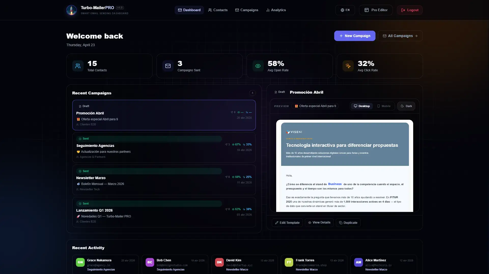
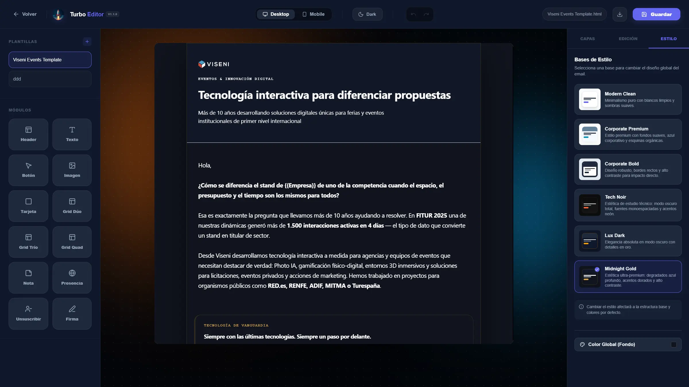
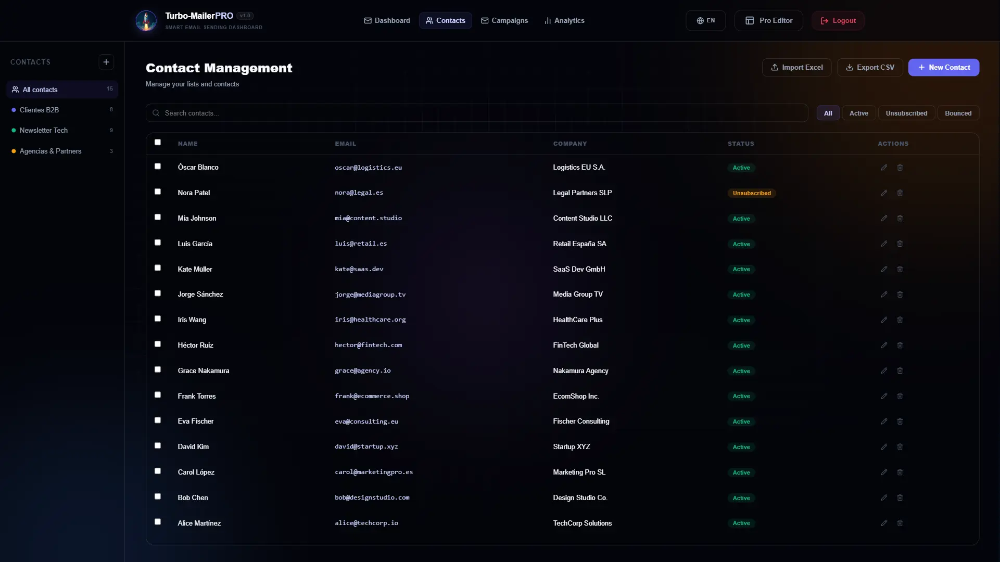
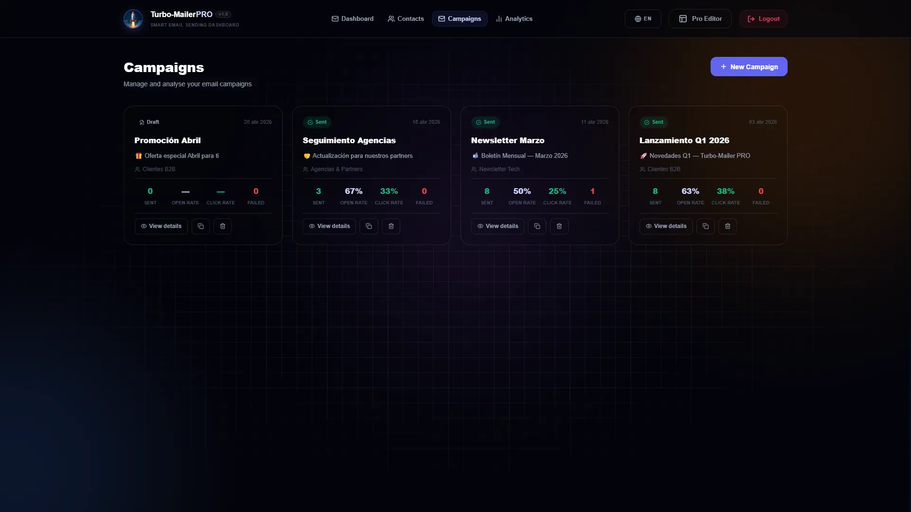
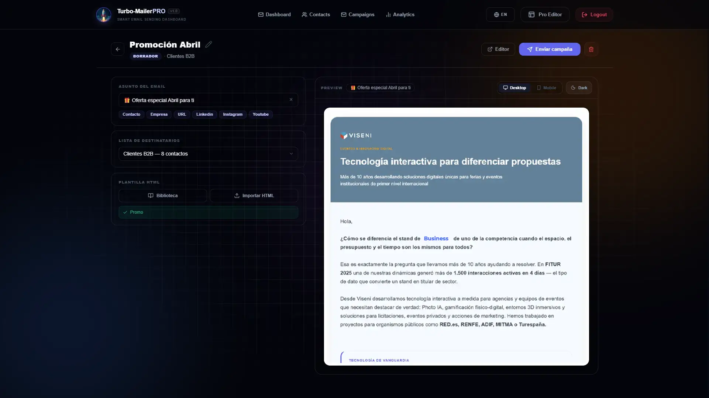
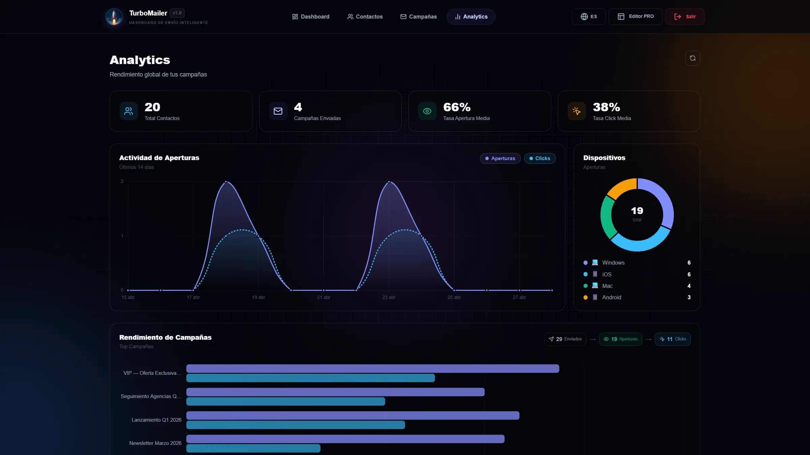
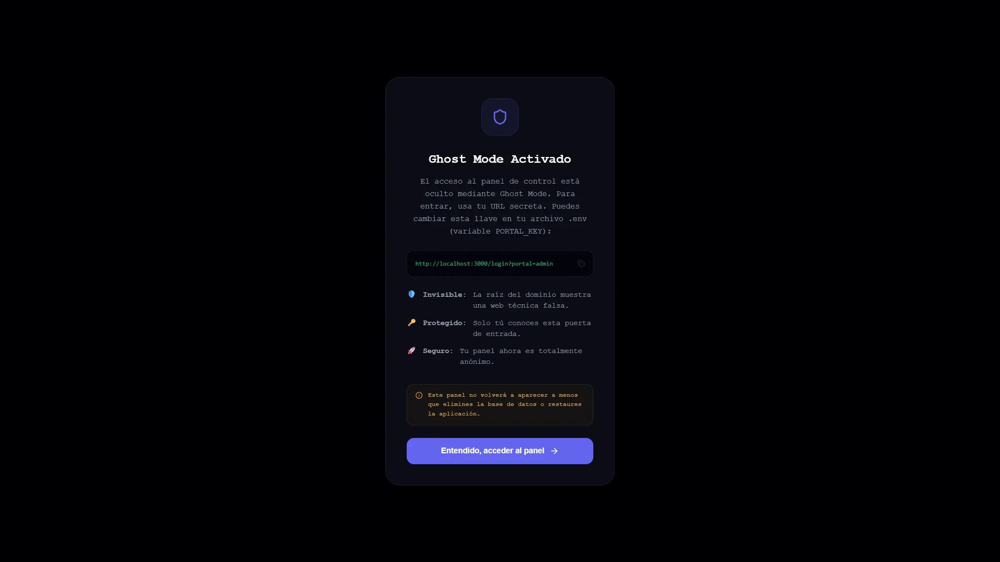

# 🚀 TurboMailer

[](https://www.gnu.org/licenses/agpl-3.0)

**[Versión en Español](README.md)**

**Complete Email Marketing Platform with CRM, HTML Template Editor, AI, Analytics, Tracking, and more.**

TurboMailer is a **self-hosted application with team roles, designed for VPS deployment**, built with **Nuxt 3**. It provides full data sovereignty, complete contact and list management, a visual HTML template editor with drag & drop blocks, a campaign system with open and click tracking, real-time analytics, AI copywriting integration, and a multilingual interface (ES/EN). All with SQLite persistence and mass sending via any SMTP service (Gmail, Outlook, Amazon SES, etc.).

> If this tool saves you time, consider supporting its development — every contribution funds more experiments and free tools for the community. ☕
>
> <a href="https://www.buymeacoffee.com/drlerian" target="_blank"></a>

## 🛡️ Your Data, Only Yours

As a self-hosted application on your own server:

- **Your own storage**: Contacts, campaigns, templates, and analytics live on your server.
- **Your choice of providers**: Your instance connects to the SMTP and AI services you configure; local AI models are also supported.


## 📸 Interface

<table>
  <tr>
    <td></td>
    <td></td>
  </tr>
  <tr>
    <td></td>
    <td></td>
  </tr>
  <tr>
    <td></td>
    <td></td>
  </tr>
  <tr>
    <td></td>
    <td></td>
  </tr>
</table>

---

## 💎 Premium edition — what's new

### 🤖 Guided AI campaign creation

- **One assistant in New Campaign and the Pro Editor**: brief, audience, offer, CTA, design, signature, preview, and iterative revisions before applying the proposal
- **Campaign context**: optional reference URL and AI images, subject A/B, preheader, follow-up subject, and a suggested send time; save a draft or explicitly choose scheduling after reviewing
- **Brand kit** extracted from your website: logo, colours, fonts, tone, and value props, available as optional context in the campaign assistant
- **Subject line lab**: variants with different angles scored with spam analysis and your audience's real history; apply them as A or B
- **Pre-send editorial review**, **post-campaign insights** with recommendations and **"Ask your data"** (with charts; it only sees aggregated numbers)
- **Segments described in plain language** and automation emails generated on-brand
- Claude (Opus 5 by default, with automatic fallback), OpenAI or **local models** (Ollama, LM Studio, vLLM)

### 📬 A send engine that doesn't break
- No duplicates even if the server dies mid-campaign; **automatic resume** on start
- Multiple SMTP senders with **failover**, per-sender DKIM, per-provider limits (Gmail/Outlook/Yahoo), **IP warm-up** and **per-contact best send time**
- **Circuit breaker** pauses the campaign when bounces, blocks or complaints spike
- Precise SMTP error classification: a policy block never marks the contact as bounced
- A/B testing with **statistical significance** (clicks → human opens), automatic follow-ups to non-openers

### ✅ Professional deliverability
- **RFC 8058 one-click unsubscribe** (required by Gmail/Yahoo), pages safe from link scanners
- **Global suppression list** (unsubscribes, bounces, complaints) that survives deletes and re-imports
- VERP + IMAP bounce processing, ARF complaints, email unsubscribes and **DMARC reports**
- Pre-send checks: SPF (10-lookup limit), DKIM, DMARC, BIMI, MTA-STS, blocklists, spam score (built-in, rspamd or SpamAssassin), email-client compatibility
- **Inbox placement tests** with seed mailboxes (Primary / Promotions / Spam) and blocklist monitoring
- Apple Mail Privacy and Gmail proxy opens separated from human ones; automatic **sunset** of inactive contacts

### 👥 Audience & automation
- **Dynamic segments** with a visual builder (behaviour, dates, fields, tags, lists)
- **Custom fields**, **subscription topics** in the preference center, **hosted/embeddable forms** with bot protection
- **Visual automations**: welcome, abandoned cart, post-purchase, win-back, anniversaries… with waits, conditions, tags, webhooks
- Templates with `{{#if}}…{{else}}…{{/if}}`, fallbacks `{{name | "friend"}}` and custom variables
- Email verification (typos, domains without mail, disposable) and **GDPR**: export and right to be forgotten

### 🏢 Platform
- **Team with roles** (owner, admin, editor, viewer) and **two-step verification** (TOTP + recovery codes)
- **Public REST API** with scoped keys and idempotency: transactional email, contacts, events
- **Settings in the UI** with encrypted secrets, **automatic backups** locally and encrypted to S3, guided restore
- **Prometheus metrics**, Slack/Telegram/email alerts, per-user audit log, **Docker** ready

---

## 🆕 Latest updates — 27 September 2026

- Unified the campaign and editor assistants, including reusable signatures with their source, desktop/mobile previews, and safe application to a new editable template.
- Expanded the Pro Editor with a searchable 23-module library, six themes, actual-width previews, individual button controls, and a template quality review panel.
- Improved mobile grids and exported email layouts. AI uses pairs by default; manually inserted Trio and Quad modules remain available.
- Aligned AI generation and refinement with the editor's **3–40 final-module capacity**, including the approved signature and unsubscribe footer. Repair requests include the full previous proposal, without silently trimming extra modules.
- Strengthened full-document undo/redo and saving when switching templates; moved interface language to Settings and repaired SMTP test delivery.
- Distinguished inactive subscribers awaiting confirmation from bounced contacts; added the automation gallery and clarified the welcome-email workflow below.
- Updated OpenAI request parameters and fixed the Nodemailer ESM entry and bounce-processor data-directory import used in server deployment.

---

## ✨ Key Features

### 👥 CRM Contacts

- SQLite database with **full contact details**: email, name, company, phone, LinkedIn, URL, YouTube, Instagram, tags, and status (`active / inactive / unsubscribed / bounced`)
- **Distribution list** management with name, description, and customizable color
- Real-time search, filtering by list and status, pagination (50/page), multiple selection, and drag-to-list
- **Bulk import** from Excel (`.xlsx`, `.xls`, `.csv`) with auto-detection of columns
- Full **CSV export** and complete CRUD from the UI
- **Inactive is not bounced**: contacts awaiting double opt-in confirmation are stored as `inactive`, shown with their own filter and status, and do not receive campaigns. Subscription requests that need confirmation report `pending_confirmation`.

### 📣 Campaign Management

- 4-step wizard: name + subject → list → template → review and send
- **Create the complete campaign with AI** opens the same guided assistant as the Pro Editor, with additional list, reference-page, image, subject A/B, follow-up, and suggested-time context
- Generating a proposal **does not send or schedule it**. After previewing and revising it, create a campaign draft or explicitly schedule the suggested time for a selected list, interpreted in the operator's local timezone
- Statuses: `draft / scheduled / sending / sent / paused`
- Automatic injection of **tracking pixel** (opens) and **tracked links** (clicks)
- Dynamic variables: `{{Company}}`, `{{Name}}`, `{{URL}}`, `{{Linkedin}}`, `{{Instagram}}`, `{{Youtube}}`
- **Background sending**: overlay auto-dismisses after 4 seconds; send continues without keeping the window open
- **Persistent progress badge**: floating indicator (bottom-right) visible across the whole app with progress bar, pause, and resume buttons
- **Professional retry management**: automatic SMTP-level retries + manual "Retry Failed" button
- **Individual resend**: per-row button to resend specific failed or pending emails

### 📊 Advanced Analytics

- Real-time KPIs: total contacts, campaigns sent, average open and click rates
- **Delivery Funnel**: Sent → Opened → Clicked
- 14-day trend, device distribution (doughnut chart), campaign performance comparison (bar chart)
- Detailed event log with device icons, company, name, and timestamps
- **Auto-refresh** every 30 seconds

### 📡 Email Tracking

- 1×1 GIF pixel at `/api/track/open` — records open and increments counter
- Tracked redirect at `/api/track/click` — records click and redirects to destination
- `trackingEvents` table with `sendId`, `campaignId`, `contactId`, `eventType`, `url`, `ip`, `userAgent`

### 🔕 Unsubscribe

- Personalized unsubscribe link per recipient in every email
- `/unsubscribe` page with confirmation and error handling
- Automatic confirmation email upon unsubscription
- Marks contact as `unsubscribed` in the database

### 📧 Deliverability & Reputation

- **List-Unsubscribe Headers**: one-click unsubscription directly from email clients (Apple Mail, Gmail)
- **Bounce Management**: intelligent detection of permanent errors (5xx), auto-marks contact as `bounced`
- **Native DKIM Signing**: configurable RSA-2048 support. Generate keys with `node scripts/generate-dkim.js yourdomain.com`
- **Rate Control**: configurable delay and jitter between sends to avoid robotic pattern detection

### 🎨 Pro Editor

- **23 native modules**: Header Pro, Hero, Text, Button, Image, Card, Grid Duo, Grid Trio, Grid Quad, Note, Presence, Testimonials, Pricing, Video, Socials, Divider, FAQ, Metrics, Spacer, Product, Coupon, Unsubscribe, and Signature
- **Searchable, categorized library** with click, keyboard, and drag & drop insertion; layers for selecting and reordering modules
- Editing panel for fonts, sizes, text and background colors, alignment, borders, and radius; image controls include alternative text and a decorative-image option
- **Individual button controls**, including buttons inside Hero, Product, and Pricing: select the button and edit its text, link, colors, font size, padding, and radius. Button modules also support adding and removing multiple buttons
- **Six global themes**: Modern Clean, Corporate Premium, Corporate Bold, Tech Noir, Lux Dark, and Midnight Gold, with improved text and button contrast
- **Actual-width preview**: desktop at **600 / 700 / 820 px**, mobile at **320 / 375 / 414 px**, with fit-to-canvas or 100% zoom and a dark-mode simulation. Imported templates retain their own width and design
- **Responsive grids**: AI prefers two-card rows; manual Trio and Quad modules have improved column sizing, wrapping, image containment, and mobile stacking. Layout rules survive HTML export and final send compilation
- **Review panel**: checks the exported HTML at **320 / 375 / 600 / 820 px** for overflow, incomplete links, image sources and loading failures, missing alternative text, placeholder content, small text, and measurable contrast issues. Select an issue to find its module; edit and run the review again
- **Full-document undo/redo** preserves styles, theme, and content. Pending edits are saved before switching templates, and a failed save keeps the current document open
- **Per-block AI** and **bulk AI** to improve copy; template gallery and saved versions, image resource manager (auto-resize to 1200px with `sharp`), and HTML download
- Shortcuts: `Ctrl+S` save · `Ctrl+Z` undo · `Ctrl+Y` redo · `Delete` delete block

The responsive previews and quality review run in the browser. They help catch design problems but do not guarantee identical rendering in every mailbox client. Before a real campaign, also send a test to the Gmail, Outlook, and other clients used by your audience.

### 🤖 AI Copywriting & Generative Design

- **Block Assistant**: improves individual blocks while preserving HTML and dynamic variables
- **Shared campaign assistant**: five guided steps cover the campaign objective and audience; offer and CTA; tone, language, theme, and visual direction; signature; and review
- **Reusable signatures**: choose a native Signature block from recent campaigns or saved templates, see its source, edit it, create a new one, or omit it. The configured sender provides a fallback when no historical signature is available; arbitrary text in imported HTML is not treated as a signature
- **Preview before applying**: inspect desktop/mobile layouts, module structure, subject, and preheader; request targeted revisions while preserving the previous proposal. In the Pro Editor, applying creates a new editable template and preserves the previous work
- **Operator-selected design**: generation uses the chosen theme, objective, visual instructions, and optional brand kit. AI is guided by the actual colors, fonts, and copy space available in the native modules
- **Cards in pairs**: three items become Grid Duo plus Card; larger groups use additional two-card rows and a final single card when needed
- **Optional campaign images**: use images from the reference page or enable generated images via Pollinations.ai; successfully resolved images are downloaded to the server
- **Complete validated proposals**: the final design supports **3–40 modules**, including the approved signature and automatically added unsubscribe footer. Pairing grids and completing the footer happen before the final size check; malformed, oversized, or incomplete responses are returned for repair with the previous proposal rather than silently truncated. If the repair still fails validation, the assistant reports the error without applying an invalid design
- **Providers**: Anthropic, OpenAI, and compatible endpoints hosted locally or remotely. OpenAI uses `max_completion_tokens` and the model's default temperature for reasoning-model compatibility; compatible non-OpenAI servers retain `max_tokens` and temperature parameters

#### Suggested workflow

1. Open **New Campaign → Create the complete campaign with AI**, or **Pro Editor → Create with AI**.
2. Complete the brief, confirm the CTA destination, select a theme, and review the signature. Campaign creation additionally accepts a list, reference URL, and optional AI images.
3. Generate and inspect the proposal. Ask for changes to copy or layout before applying it.
4. Save the new template or campaign draft. In campaign mode, scheduling the suggested time is a separate explicit action.
5. In the Pro Editor, check the relevant desktop/mobile widths and run **Review template**. Resolve content warnings and send a real test before launching the campaign.

### 🌐 Multi-language (i18n)

- Full interface in **Spanish** and **English**
- Real-time interface language switching in **Settings → General → Interface**, without a page reload; the control has moved out of the navigation bar
- Interface language is separate from the instance's default language and the language selected for AI-generated content

### ⚙️ Settings & SMTP tests

- **Settings → Sending** manages saved SMTP profiles and delivery limits
- The connection-test button on a sender row checks the saved profile's connection and authentication **without sending a message**
- **Send test email to** accepts a recipient and a saved sender profile. Submitting it verifies the connection and sends a real test message, with separate connection and delivery errors
- Save profile changes before testing: unsaved values in the sender editor are not used by these tests. Check the received message and its authentication headers as well as the success notification

### 🔁 Forms & welcome automations

- The **Automations** page includes a gallery for welcome, abandoned-cart, post-purchase, re-engagement, anniversary, and blank workflows, with run counts and duplication controls
- A form's **success message** is the response shown after submission. The **confirmation email** requests double opt-in consent. A **welcome email** is separate content configured in an automation
- To send a welcome series, create a **Welcome** automation, configure its **Subscribed** trigger and optional list, review its email steps and delays, and activate it. Edit the subject/preheader in an Email step and use a saved Pro Editor template or the AI writing option for its body
- With double opt-in enabled and SMTP configured to deliver confirmation messages, new subscribers remain inactive until they confirm; confirmation emits the **Subscribed** event that can start the welcome automation. It does not replay the **Form submitted** event
- Deleting an automation removes its runs but preserves its campaign send history. A form's success message does not configure a welcome email; that requires a matching active automation

### 🧹 Selective Reset

From the Dashboard → **Reset** button:

- **Everything (Aggressive Reset)**: deletes all records and template files
- **Database Only**: clears data but preserves templates
- **By Module**: Contacts / Campaigns / Analytics
- **Reconfigure**: deletes `data/.installed` and `data/config.json` → redirects to the setup wizard
- **Automatic backup**: generates a `.zip` before any mass reset

### 🔒 Privacy & SEO

- `noindex`, `nofollow`, `noarchive` meta tags
- `robots.txt` blocks all crawlers

---

## 🛠️ Technologies

| Area          | Technology                                                                     |
| ------------- | ------------------------------------------------------------------------------ |
| Framework     | [Nuxt 3](https://nuxt.com/) — SPA mode (`ssr: false`)                          |
| Database      | [SQLite](https://www.sqlite.org/) via [Drizzle ORM](https://orm.drizzle.team/) |
| Emailing      | [Nodemailer](https://nodemailer.com/) — SMTP (Gmail, Outlook, etc.)            |
| Data Handling | [XLSX (SheetJS)](https://sheetjs.com/)                                         |
| AI            | Anthropic, [OpenAI API](https://platform.openai.com/), and compatible local or remote endpoints; provider and model configurable in Settings |
| i18n          | [@nuxtjs/i18n](https://i18n.nuxtjs.org/)                                       |
| Icons         | [Lucide Vue Next](https://lucide.dev/)                                         |
| PWA           | `@vite-pwa/nuxt`                                                               |

---

## 🗄️ Database (Zero-CLI)

TurboMailer manages the database **100% automatically**.

- **Auto-Installation**: creates the SQLite file and all tables on first start
- **Auto-Migration**: detects schema changes and updates the database on restart
- **Auto-Recreation**: if you delete the `.db` file, the app regenerates it instantly

SQLite in `./data/turbomailer.db`. Main tables:

| Table            | Description                                            |
| ---------------- | ------------------------------------------------------ |
| `contacts`       | Contacts with all fields and subscription status       |
| `lists`          | Distribution lists with name, description, and color   |
| `listContacts`   | M×N relationship contacts ↔ lists (cascade delete)     |
| `campaigns`      | Campaigns with status, counters, and timestamps        |
| `sends`          | Individual sends per recipient with status and error   |
| `trackingEvents` | Open and click events with metadata                    |

---

## 🧙 Setup Wizard

TurboMailer includes a **first-run setup wizard** that guides you through configuration step by step. No manual `.env` editing required.

### How it works

When you access the app without any prior configuration, it automatically redirects to `/setup`. The wizard covers **6 steps**:

| Step | Content |
|------|---------|
| 1 | **Security** — Admin password (automatically hashed with BCrypt) |
| 2 | **SMTP** — Host, port, user, password, sender name and email. Includes live connection test and advanced rate-control options |
| 3 | **App Config** — Tracking base URL, HMAC secrets (auto-generated or manual) |
| 4 | **OpenAI** *(optional)* — API key and model for AI copywriting |
| 5 | **DKIM** *(optional)* — Domain, selector, and RSA private key for email signing |
| 6 | **Review & Install** — Full summary before writing the configuration |

### After completing the wizard

The system automatically generates:
- `data/config.json` — runtime configuration (read on every request)
- `.env` — reference copy for manual edits
- `data/.installed` — sentinel file marking the app as installed

It then shows clear instructions to **restart the application** (in Plesk or your environment) and **automatically detects** when the server has come back up to redirect you to the login page.

### Reconfigure

Use **Settings** for normal changes to SMTP, AI, identity, and delivery options. **Dashboard → Reset → Reconfigure** reruns the initial setup wizard when a full reconfiguration is needed.

---

## 🐳 Docker installation

```bash
echo "ENCRYPTION_KEY=$(openssl rand -hex 32)" > .env   # keep a copy: it decrypts your secrets
docker compose up -d                                   # http://localhost:3000/setup
docker compose --profile spam up -d                    # optional: rspamd for spam analysis
```

Data lives in the `turbomailer-data` volume (`/data`). Put an HTTPS reverse proxy (Caddy, Traefik, nginx) in front and use its URL as the public app URL.

## 🚀 Quick Installation

1. **Clone the repository**

   ```bash
   git clone https://github.com/crazyramirez/turbo-mailer.git
   cd turbo-mailer
   ```

2. **Install dependencies**

   ```bash
   npm install
   ```

3. **Start the application**

   ```bash
   npm run dev        # development
   npm run build      # production (then node .output/server/index.mjs)
   ```

4. **Open in your browser**

   The app automatically detects that it's not configured and redirects to `/setup`. The wizard handles the entire configuration.

   > On Plesk or other Node.js environments: after completing the wizard, restart the application from the panel for changes to take effect. The wizard provides exact steps and automatically detects the restart.

### Updating a production deployment

After pulling the updated source, install dependencies with `npm ci`, run `npm run build`, and restart the Node.js process from Plesk or your process manager. The production entry point is `.output/server/index.mjs` (`npm start`); rebuilding without restarting leaves the previous server process running.

Keep the runtime data directory across deployments. It defaults to `./data`; `DATA_DIR` can point to a persistent writable directory for configuration, database, templates, uploads, and backups. The 27 September fixes correct the Nodemailer ESM import used by spam checking and the bounce processor's shared data-directory import, resolving the related startup errors.

### Development checks

```bash
npm test           # unit and regression tests
npm run typecheck  # Vue / TypeScript checks
npm run build      # production build
```

The latest implementation validation on **27 September 2026** passed **549 tests**, type checking, and the production build. The Pro Editor layout review also checked **72 browser configurations** without overflow. Automated AI tests use simulated responses; they do not verify live generation with every provider. These checks do not replace delivery and rendering tests in real email clients.

---

## 🎯 First Use — Demo Database

After installation, opening the dashboard for the first time (empty database) shows a welcome screen with two options:

**Option A — Sample data**: loads `data/turbomailer_demo.db` with pre-filled contacts, campaigns, statistics, and tracking events to explore all features immediately.

**Option B — Start from scratch**: empty database ready for your own contacts.

> `data/turbomailer_demo.db` is never deleted. You can reload demo data at any time with **Reset → Everything**.

---

## 👻 Invisible Security (Ghost Mode)

TurboMailer is designed to be invisible to curious visitors or crawlers.

1. **Decoy Root**: `/` shows a technical status page simulating an SMTP node. The admin panel is "hidden" at `/dashboard`.
2. **Hidden Login**: accessing `/login` directly shows a fake 404 (Apache/Ubuntu style).
3. **How to access**: `yourdomain.com/login?portal=YOUR_PORTAL_KEY`

Once logged in, you can navigate normally. After logout, you return to the decoy page.

The `portal=` key is saved to `localStorage` and **immediately stripped from the address bar** so it's never exposed.

### GHOST_MODE variable

- **`GHOST_MODE=true`**: hides the root entirely — any unauthenticated access goes directly to `/login`
- **`GHOST_MODE=false`** (default): shows the decoy status page at `/`

> The wizard generates `PORTAL_KEY=admin` and `GHOST_MODE=false` by default. Edit `.env` to change them and restart.

---

## 🔑 Example: Gmail Configuration

Gmail SMTP requires a 16-digit app password (not your regular password).

1. Enable **2-Step Verification**: [Google Account → Security](https://myaccount.google.com/security)
2. Generate a password at [myaccount.google.com/apppasswords](https://myaccount.google.com/apppasswords)
3. Enter a name (e.g., `TurboMailer`) and copy the 16-character code
4. In wizard step 2: `SMTP_HOST=smtp.gmail.com`, `SMTP_PORT=465`, paste the code as the SMTP password

---

## 🔐 Password Security (BCrypt)

The wizard automatically hashes your password with BCrypt (cost 12). To change it manually later:

```bash
npm run hash-password
# Or pass the password directly:
npm run hash-password my-secure-password
```

Paste the resulting hash into `APP_PASSWORD` in your `.env` and restart.

---

## 📡 API Reference

### Auth

| Method | Route              | Description                |
| ------ | ------------------ | -------------------------- |
| POST   | `/api/auth/login`  | Master-password login, or team email/password and second factor when enabled |
| GET    | `/api/auth/check`  | Check active session       |
| POST   | `/api/auth/logout` | Log out                    |

### Contacts

| Method | Route                  | Description                              |
| ------ | ---------------------- | ---------------------------------------- |
| GET    | `/api/contacts`        | List with search, filter, and pagination |
| POST   | `/api/contacts`        | Create contact                           |
| GET    | `/api/contacts/[id]`   | Detail with associated lists             |
| PUT    | `/api/contacts/[id]`   | Update fields and tags                   |
| DELETE | `/api/contacts/[id]`   | Delete contact                           |
| POST   | `/api/contacts/import` | Bulk import from array                   |
| GET    | `/api/contacts/export` | Export full CSV                          |

### Lists

| Method | Route                                  | Description                   |
| ------ | -------------------------------------- | ----------------------------- |
| GET    | `/api/lists`                           | List with contact count       |
| POST   | `/api/lists`                           | Create list                   |
| PUT    | `/api/lists/[id]`                      | Update name/description/color |
| DELETE | `/api/lists/[id]`                      | Delete list (cascade)         |
| POST   | `/api/lists/[id]/contacts`             | Add contacts in batch         |
| DELETE | `/api/lists/[id]/contacts/[contactId]` | Remove contact from list      |

### Campaigns

| Method | Route                                       | Description                       |
| ------ | ------------------------------------------- | --------------------------------- |
| GET    | `/api/campaigns`                            | List campaigns (filter by status) |
| POST   | `/api/campaigns`                            | Create draft                      |
| GET    | `/api/campaigns/[id]`                       | Detail with metrics               |
| PUT    | `/api/campaigns/[id]`                       | Update campaign                   |
| DELETE | `/api/campaigns/[id]`                       | Delete campaign                   |
| POST   | `/api/campaigns/[id]/send`                  | Launch send                       |
| POST   | `/api/campaigns/[id]/retry`                 | Retry failed sends                |
| POST   | `/api/campaigns/[id]/pause`                 | Pause active send                 |
| GET    | `/api/campaigns/[id]/progress`              | Real-time send progress           |
| POST   | `/api/campaigns/[id]/sends/[sendId]/resend` | Resend individual recipient       |
| GET    | `/api/campaigns/[id]/sends`                 | List individual sends             |

### Tracking & Analytics

| Method | Route              | Description          |
| ------ | ------------------ | -------------------- |
| GET    | `/api/track/open`  | Open pixel (GIF 1×1) |
| GET    | `/api/track/click` | Tracked redirect     |
| GET    | `/api/analytics`   | Dashboard KPIs       |
| GET    | `/api/unsubscribe` | Unsubscribe          |
| DELETE | `/api/reset`       | Selective data reset |

### Resources (Images)

| Method | Route          | Description                       |
| ------ | -------------- | --------------------------------- |
| GET    | `/api/uploads` | List images stored on the server  |
| POST   | `/api/uploads` | Upload and resize images (1200px) |
| DELETE | `/api/uploads` | Delete image file                 |

### Pro Editor & AI

| Method | Route | Description |
| ------ | ----- | ----------- |
| GET | `/api/ai/editor-context` | Brand context and reusable signatures with their campaign, template, or sender source |
| POST | `/api/ai/generate-template` | Generate or revise a validated native-module proposal from the assistant brief; does not save, send, or schedule it |
| GET | `/api/ai/status` | Read the configured provider, model, and AI usage |
| POST | `/api/ai/improve` | Improve existing email copy |
| POST | `/api/ai/download-image` | Store an allowed remote image for use in a template |
| GET | `/api/templates` | List templates, or read one using `name` |
| POST | `/api/templates` | Save template HTML |

The shared assistant uses `/api/ai/generate-template`. Campaign creation subsequently saves the template and calls `/api/campaigns`; saving a proposal in the Pro Editor creates a template without creating a campaign.

### Settings, forms & automations

| Method | Route | Description |
| ------ | ----- | ----------- |
| GET / PUT | `/api/settings` | Read or update settings, subject to account permissions |
| PUT / DELETE | `/api/settings/senders` | Save or remove an SMTP profile |
| POST | `/api/settings/test-smtp` | Verify saved sender `id`; optional `to` additionally sends a real test email |
| POST | `/api/forms/[publicId]/submit` | Submit a public form with its consent and anti-bot checks |
| GET / POST | `/api/confirm` | Display the double opt-in confirmation page / confirm the subscription |
| GET / POST | `/api/automations` | List workflows / create a draft workflow |
| GET / PUT / DELETE | `/api/automations/[id]` | Inspect, edit or change workflow status, or delete it |
| POST | `/api/automations/[id]/enroll` | Manually enroll contacts in an active workflow |

---

## 🔑 External Integration (API Key)

Connect your forms or external applications directly to TurboMailer.

### Public API v1 with scoped keys

Create a key in **Settings → Integrations** and select its permissions. Keys begin with `tm_` and are displayed once at creation. Send the key as `Authorization: Bearer tm_…` or `X-API-Key: tm_…`.

| Method | Route | Required scope | Description |
| ------ | ----- | -------------- | ----------- |
| GET | `/api/v1/ping` | Any granted scope | Check the key and API availability |
| GET | `/api/v1/campaigns` | `campaigns:read` | Recent campaigns and metrics |
| GET | `/api/v1/contacts?email=…` | `contacts:read` | Contact details, lists, and suppression status |
| POST | `/api/v1/contacts` | `contacts:write` | Create or update a subscription under the consent rules |
| DELETE | `/api/v1/contacts?email=…` | `contacts:write` | GDPR erasure; this deletes personal data rather than unsubscribing |
| POST | `/api/v1/events` | `events` | Submit a contact event for matching automations |
| POST | `/api/v1/send` | `send` | Queue a transactional email |
| GET | `/api/v1/sends/[id]` | `send` | Delivery status and events for a send |

Use an `Idempotency-Key` for retries of `POST /api/v1/send` and `POST /api/v1/contacts`. Reuse it only for the same operation: cached responses are scoped to the API key, so different operations need different idempotency values, including across endpoints.

### Legacy subscription API authentication

The `/api/subscribe` and `/api/unsubscribe` examples below use the instance's `API_SECRET`, not a scoped `tm_` key. Include either header:

```http
X-API-Key: your-api-secret-key
```

or

```http
Authorization: Bearer your-api-secret-key
```

For these legacy routes, the value is `API_SECRET` from your `data/config.json` / `.env` (auto-generated by the wizard).

### Subscribe (`POST /api/subscribe`)

```bash
curl -X POST https://your-domain.com/api/subscribe \
  -H "Content-Type: application/json" \
  -H "X-API-Key: your-api-secret-key" \
  -d '{"email":"contact@example.com","name":"John Doe","tags":["lead"],"listIds":[1]}'
```

Parameters: `email` (required), `name`, `company`, `phone`, `role`, `linkedin`, `url`, `tags[]`, `listIds[]`

When double opt-in is required, a successful request can return `pendingConfirmation: true`: the contact remains `inactive` until confirmation. Previously unsubscribed contacts must confirm a new subscription; bounced, complained, and invalid suppressed addresses are not reactivated by a form or API request.

### Unsubscribe (`POST /api/unsubscribe`)

```bash
curl -X POST https://your-domain.com/api/unsubscribe \
  -H "Content-Type: application/json" \
  -H "X-API-Key: your-api-secret-key" \
  -d '{"email":"contact@example.com"}'
```

---

## 📄 Demo Templates

- Professional sample template: `data/demo/email_demo.html`
- Sample contact lists: `data/demo/contacts_demo.csv` and `data/demo/contacts_demo.xlsx`

---

## 📝 ToDo / Pending

- [x] **Setup Wizard** — Guided initial configuration at `/setup`, no manual `.env` editing needed
- [x] **Campaigns** — Wizard, sending, statuses, injected tracking. Functional and basic tested
- [x] **Contacts** — CRUD, Excel import, CSV export, drag-to-list, pagination, and filters
- [x] **Analytics** — KPIs, latest opens, top campaigns, and tracking events
- [x] **Internationalize Editor** — Visual editor internationalized (ES/EN)
- [x] **Shared AI Assistant** — Guided campaign/template creation, reusable signatures, previews, and iterative revision
- [x] **Pro Editor Review** — Searchable modules, six themes, responsive email layouts, actual-width previews, and quality checks
- [x] **Reliable Editing** — Full-document history, individual module-button controls, and save protection during template changes
- [x] **Settings & Subscriber Status** — Interface language in General, working SMTP test delivery, and inactive contacts distinct from bounces
- [ ] **Editor UI on phones** — The editing workspace is intended for desktop; mobile email previews are supported, but a full phone editing experience remains pending
- [ ] **Real-client rendering matrix** — Expand verification in actual Gmail, Outlook, and other mailbox clients

---

## ⚖️ License

Licensed under **GNU Affero General Public License v3.0 (AGPL-3.0)**.

- **Copyleft**: modifications must be released under the same license
- **Network Interaction**: if you run a modified version as a service (SaaS), you **must** provide the source code to your users
- **Commercial Use**: free for personal and open-source projects. For commercial use without opening your source code, a **private commercial license** is required

For commercial licensing inquiries, please contact me.

---

⚠️ **Responsible Use:** Designed for legitimate, permission-based mailings (newsletters, B2B). **Spam is strictly prohibited.** By using this tool, you agree to comply with Google's policies and applicable privacy laws (GDPR, CAN-SPAM Act, etc.) under your own responsibility.

**Developed with ❤️ by Crazyramirez while devouring countless YouTube podcasts in the background.**
