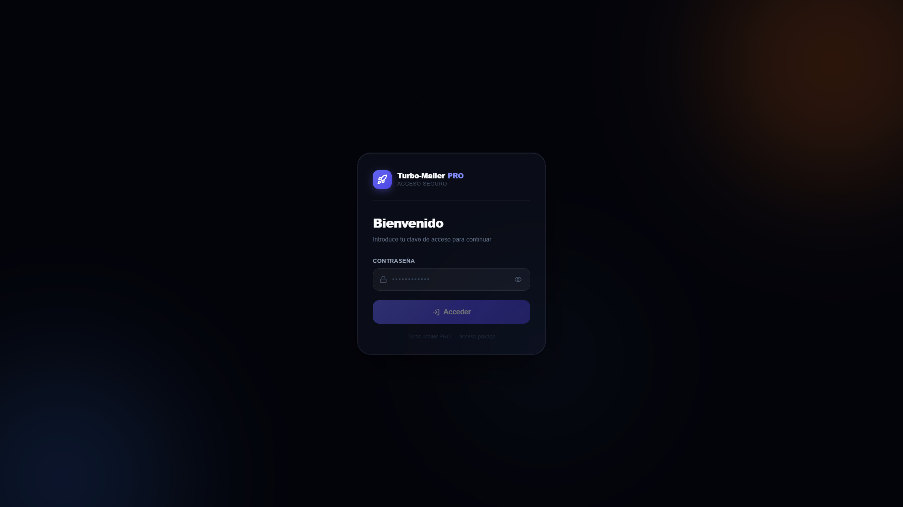
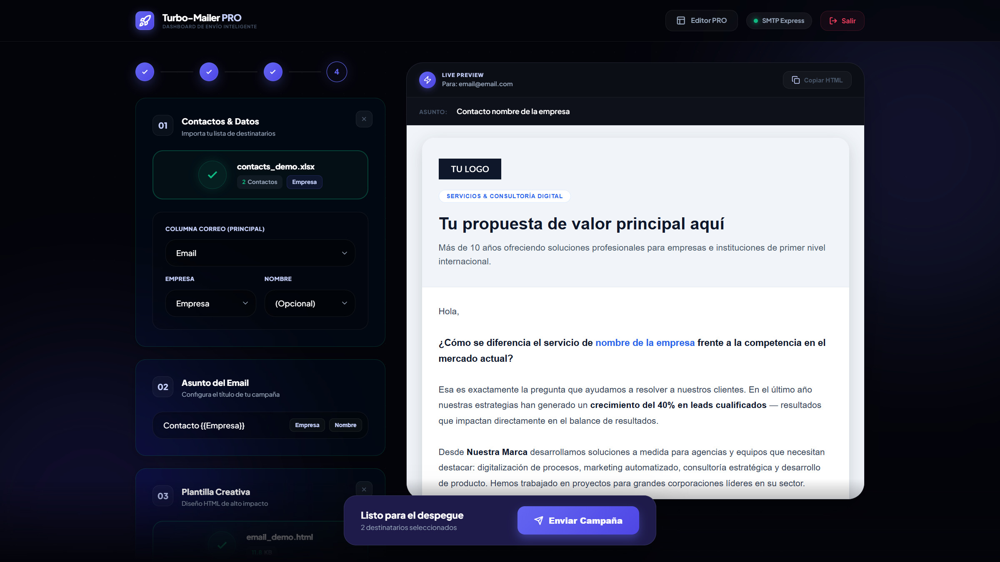
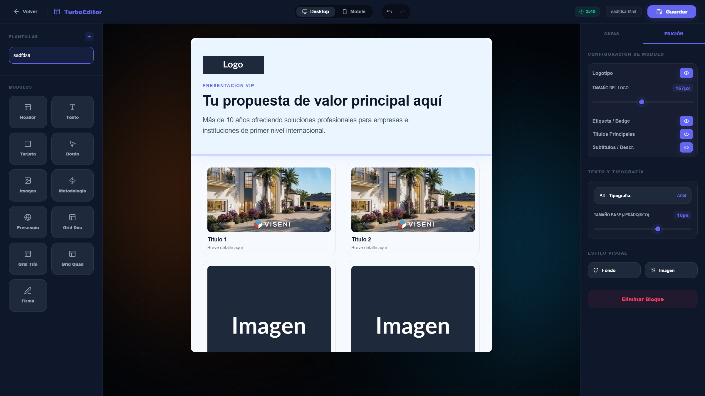

# 🚀 Turbo-Mailer PRO

**Dashboard de Envío Inteligente & Gestión de Campañas Premium**

Turbo-Mailer PRO es una solución de escritorio/PWA de alto rendimiento diseñada para simplificar el envío masivo de correos electrónicos personalizados. Construido con **Nuxt 3** y un enfoque en la experiencia de usuario (UX) institucional, permite gestionar campañas complejas con importación directa de datos y previsualización en tiempo real.


## 📸 Interfaz del Proyecto

|                 Simple Login                  |                 Dashboard                  |                        Editor                        |
| :-------------------------------------------: | :----------------------------------------: | :--------------------------------------------------: |
|  |  |  |

---

## ✨ Características Principales

- **📊 Importación Inteligente**: Soporte nativo para archivos `.xlsx`, `.xls` y `.csv`. Mapeo automático de columnas para correos, nombres y empresas.
- **🎨 Live Preview Real-Time**: Visualiza exactamente cómo se verá tu diseño HTML para cada destinatario antes de presionar enviar.
- **🏷️ Variables Dinámicas**: Personalización profunda tanto en el asunto como en el cuerpo del correo usando el motor de etiquetas `{{Empresa}}`, `{{Contacto}}`, etc.
- **🛠️ Motor SMTP Express**: Integración robusta con servicios de correo (Gmail, Outlook, SMTP propio) vía Nodemailer con reporte de resultados en tiempo vivo.
- **📱 PWA & Mobile First**: Instalable como aplicación nativa en Windows/iOS/Android para una gestión rápida desde cualquier lugar.
- **🎨 Editor de Plantillas Visual**: Editor Drag & Drop institucional para crear y modificar plantillas HTML sin tocar código. Con sistema de bloques, edición de texto enriquecido y gestión de imágenes.
- **🤖 IA Copywriting Assistant**: Integración con OpenAI (GPT-4o) para mejorar, profesionalizar y optimizar los textos de tus correos con un solo clic, respetando el diseño HTML y las variables de personalización.
- **🌙 Dark Mode Simulator**: Previsualización realista que simula cómo las apps de correo (como Gmail) transforman tus diseños a modo oscuro, asegurando que tu mensaje sea siempre legible.
- **📂 Galería de Plantillas Premium**: Biblioteca integrada para guardar, renombrar, eliminar y gestionar tus propios diseños institucionales de forma eficiente.
- **🔒 Acceso Protegido**: Sistema de login mediante contraseña maestra configurada por entorno con limitación de intentos por IP para máxima seguridad.
- **💎 Diseño de Vanguardia**: Interfáz ultramoderna con tipografía _Plus Jakarta Sans_, efectos de glassmorfismo, animaciones quirúrgicas y navegación intuitiva por pasos.

---

## 🛠️ Tecnologías

- **Framework**: [Nuxt 3](https://nuxt.com/) (Vue 3 SSR/Client)
- **Emailing**: [Nodemailer](https://nodemailer.com/)
- **Data Handling**: [XLSX (SheetJS)](https://sheetjs.com/)
- **Icons**: [Lucide Vue Next](https://lucide.dev/)
- **Offline/PWA**: `@vite-pwa/nuxt`

---

## 🚀 Instalación Rápida

1. **Clonar el repositorio**

   ```bash
   git clone https://github.com/tu-usuario/turbo-mailer.git
   cd turbo-mailer
   ```

2. **Instalar dependencias**

   ```bash
   npm install
   ```

3. **Configurar el entorno**
   Crea un archivo `.env` en la raíz del proyecto con tus credenciales:

   ```env
   # Configuración de Gmail
   GMAIL_USER=tu-correo@gmail.com
   GMAIL_APP_PASSWORD=tu-password-de-aplicacion-de-16-caracteres

   # Acceso a la Aplicación
   APP_PASSWORD=tu-contraseña-de-acceso-al-dashboard

   # Inteligencia Artificial (Opcional)
   OPENAI_API_KEY=tu-api-key-de-openai
   OPENAI_MODEL=gpt-4o-mini
   ```

### 🔑 Cómo crear una "App Password" de Gmail

Para enviar correos desde esta aplicación usando tu cuenta de Gmail, necesitas una contraseña de aplicación (App Password) de 16 dígitos:

1. **Activar Verificación en 2 Pasos**: Ve a tu [Cuenta de Google > Seguridad](https://myaccount.google.com/security) y asegúrate de que la "Verificación en 2 pasos" esté **Activada**.
2. **Generar Contraseña**: Accede directamente a **[https://myaccount.google.com/apppasswords](https://myaccount.google.com/apppasswords)**.
3. **Configurar**:
   - Escribe un nombre descriptivo (ejemplo: `Turbo Mailer PRO`).
   - Haz clic en **Crear**.
4. **Copiar Código**: Copia el código de 16 caracteres generado (sin espacios) y pégalo en el campo `GMAIL_APP_PASSWORD` de tu archivo `.env`.

---

4. **Iniciar en desarrollo**
   ```bash
   npm run dev
   ```

---

## 📋 Guía de Uso

### 1. Cargar Contactos

Arrastra tu archivo Excel a la zona de "Contactos & Datos". La plataforma detectará automáticamente la columna de correo. Puedes ajustar el mapeo manualmente si es necesario.

### 2. Configurar Asunto

Escribe el asunto de tu campaña. Puedes usar etiquetas como `{{Contacto}}` para aumentar la tasa de apertura:
_Ejemplo: "¡Hola {{Contacto}}! Tenemos algo para {{Empresa}}"_

### 3. Diseñar o Cargar Plantilla

Sube tu propio archivo `.html` o utiliza el **Editor Visual** integrado para construir una plantilla profesional desde cero mediante drag-and-drop. El sistema permite gestionar una biblioteca de plantillas personalizadas. El dashboard mostrará una previsualización inmediata con datos reales.

### 4. Envío y Resultados

Haz clic en "Enviar Campaña". Se desplegará un panel de monitoreo donde verás el progreso de los envíos exitosos y fallidos en tiempo real.

---

## 📄 Plantillas de Demo

Encuentra una plantilla de ejemplo profesional y optimizada en:
`docs/email_demo.html`

---

## 🛡️ Aviso Legal

Este proyecto es una herramienta de desarrollo. El uso indebido para comunicaciones no solicitadas (SPAM) está prohibido. Asegúrate de cumplir con las normativas locales (GDPR, CAN-SPAM Act) antes de realizar envíos masivos.

---

**Desarrollado con ❤️ por el equipo de Turbo-Mailer PRO.**
