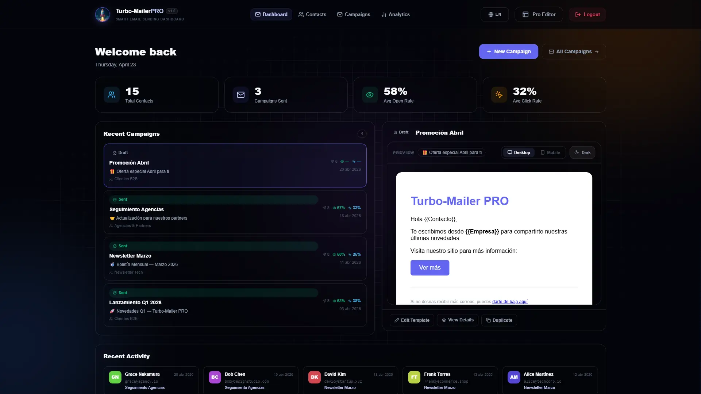
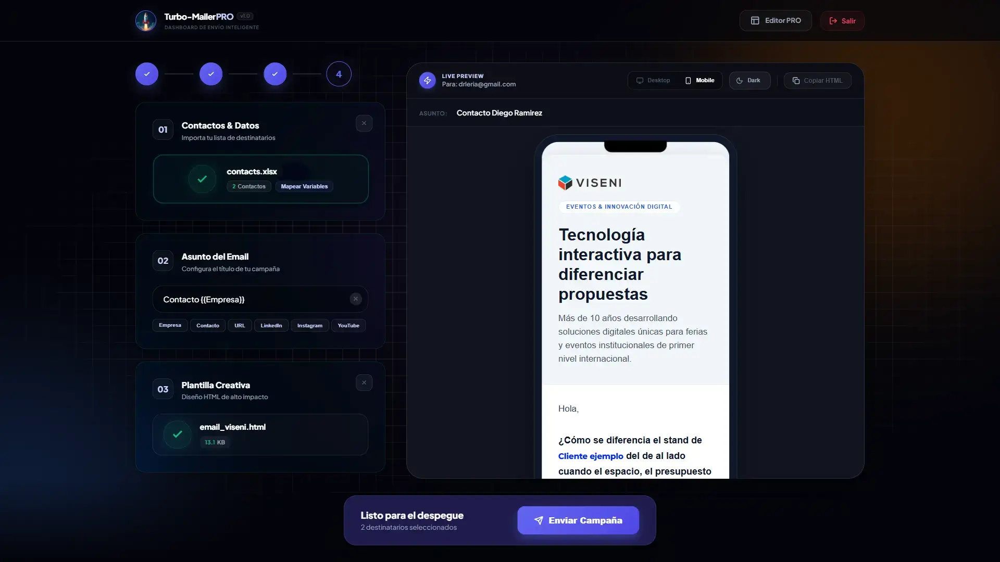
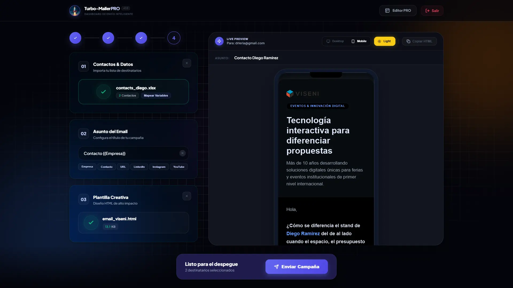
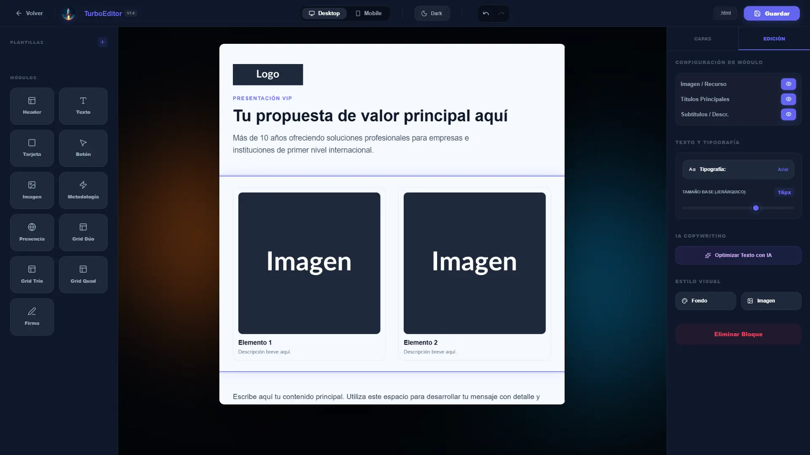

# 🚀 Turbo-Mailer PRO 🚀

**Dashboard de Envío Inteligente & Gestión de Campañas Premium**

> ⚠️ **Uso Responsable — Leer antes de usar**
>
> Turbo-Mailer PRO es una herramienta profesional diseñada exclusivamente para **envíos de email legítimos, controlados y con consentimiento previo**: comunicaciones corporativas, newsletters opt-in, campañas B2B entre contactos propios y notificaciones transaccionales.
>
> **No está diseñada, ni debe usarse, para spam o envíos masivos no solicitados.**
>
> El uso de esta aplicación implica la aceptación total de las políticas de uso de Gmail/Google, la normativa vigente (GDPR, CAN-SPAM Act, LSSI-CE) y las leyes de privacidad aplicables en tu país. **El desarrollador de Turbo-Mailer PRO no asume ninguna responsabilidad por el uso indebido de la herramienta**, incluyendo el incumplimiento de dichas normativas, bloqueos de cuenta o consecuencias legales derivadas de un uso no autorizado.

Turbo-Mailer PRO es una solución de escritorio/PWA de alto rendimiento para envío masivo de correos personalizados. Construido con **Nuxt 3**, permite gestionar campañas completas con importación directa desde Excel, editor visual de plantillas HTML, previsualización en tiempo real e integración con IA para mejorar los textos.


## 📸 Interfaz del Proyecto

| :----------------------------------: | :----------------------------------: |
|  |  |
|  |  |

---

## ✨ Características Principales

- **📊 Importación Inteligente**: Soporte para `.xlsx`, `.xls` y `.csv`. Detección automática de columnas para correo, empresa, contacto, LinkedIn, URL, YouTube e Instagram.
- **🎨 Live Preview en Tiempo Real**: Visualiza el correo personalizado con los datos reales del primer contacto antes de enviar. Toggle desktop / móvil / modo oscuro.
- **🏷️ Variables Dinámicas**: Personalización en asunto y cuerpo con `{{Empresa}}`, `{{Contacto}}`, `{{URL}}`, `{{Linkedin}}`, `{{Instagram}}`, `{{Youtube}}`.
- **🛠️ Motor SMTP Gmail**: Envío masivo vía Nodemailer + Gmail App Password con reporte en tiempo real de éxitos y fallos por destinatario.
- **🎨 Editor de Plantillas Visual**: Editor Drag & Drop con bloques (Header, Hero, Card, Botones, Imagen, Texto, Separador, Footer), panel de fuentes, panel de capas y controles de estilo por bloque.
- **🤖 IA Copywriting Assistant**: Integración con OpenAI (GPT-4o-mini / GPT-4o) para mejorar el texto de bloques individuales o toda la plantilla con un clic. Preserva el HTML y las variables.
- **📂 Galería de Plantillas**: Biblioteca integrada para guardar, cargar, renombrar y eliminar plantillas HTML propias. Persistencia en servidor.
- **🔒 Acceso Protegido**: Login con contraseña maestra configurable. Rate limiting por IP: 10 intentos fallidos bloquean el acceso durante 15 minutos.
- **📱 PWA & Mobile First**: Instalable como app nativa en Windows / iOS / Android con soporte offline vía Service Worker.
- **💎 Diseño de Vanguardia**: UI ultramoderna con tipografía _Plus Jakarta Sans_, glassmorfismo, animaciones y flujo de trabajo en 4 pasos guiados.

---

## 🛠️ Tecnologías

- **Framework**: [Nuxt 3](https://nuxt.com/) — SPA mode (`ssr: false`)
- **Emailing**: [Nodemailer](https://nodemailer.com/) — Gmail SMTP
- **Data Handling**: [XLSX (SheetJS)](https://sheetjs.com/)
- **IA**: [OpenAI API](https://platform.openai.com/) — GPT-4o-mini (configurable)
- **Icons**: [Lucide Vue Next](https://lucide.dev/)
- **Offline/PWA**: `@vite-pwa/nuxt`

---

## 🚀 Flujo de Trabajo

La app guía el envío en **4 pasos**:

1. **Contactos** — Arrastra tu archivo Excel. La app detecta automáticamente las columnas de correo, empresa, nombre y redes sociales.
2. **Asunto** — Escribe el asunto de la campaña. Usa los botones de variables para personalización dinámica.
3. **Plantilla** — Sube un archivo `.html` listo o abre el **Editor Visual** para construir tu diseño desde cero con bloques drag & drop.
4. **Envío** — Revisa la previsualización en tiempo real y envía. Verás el resultado (enviados / fallidos) por destinatario al instante.

> **Nota:** Los datos de contactos y asunto se mantienen en memoria. No persisten si recargas la página. Las plantillas sí se guardan en servidor.

---

## 🎨 Editor Visual de Plantillas

Accesible desde `/editor`. Funciones clave:

- **Bloques disponibles**: Header, Hero, Card (standard/premium), Botones, Imagen, Texto, Separador, Footer
- **Panel de edición**: Fuente, tamaño, color de texto y fondo, alineación por bloque
- **Panel de capas**: Árbol visual de bloques con reordenamiento drag & drop
- **IA por bloque**: Selecciona un bloque y mejora su texto con un clic
- **IA masiva**: Mejora todos los bloques de la plantilla a la vez
- **Atajos de teclado**: `Ctrl+S` guardar · `Ctrl+Z` deshacer · `Ctrl+Y` rehacer · `Delete` eliminar bloque
- **Autosave**: Guardado automático al detectar cambios

---

## 🚀 Instalación Rápida

1. **Clonar el repositorio**

   ```bash
   git clone https://github.com/tu-usuario/turbo-mailer.git
   cd turbo-mailer
   ```

2. **Instalar dependencias**

   ```bash
   npm install
   ```

3. **Configurar el entorno**

   Renombra `.env.template` a `.env` en la raíz del proyecto y completa los campos:

   ```env
   # Acceso a la Aplicación (requerido)
   APP_PASSWORD=tu-contraseña-de-acceso

   # Gmail SMTP (requerido para enviar)
   GMAIL_USER=tu-correo@gmail.com
   GMAIL_APP_PASSWORD=tu-app-password-de-16-caracteres

   # Inteligencia Artificial (opcional)
   OPENAI_API_KEY=sk-...
   OPENAI_MODEL=gpt-4o-mini
   ```

4. **Iniciar en desarrollo**

   ```bash
   npm run dev
   ```

---

### 🔑 Cómo crear una App Password de Gmail

La app usa Gmail SMTP con una contraseña de aplicación de 16 dígitos (no tu contraseña normal).

1. **Activar Verificación en 2 Pasos**: [Cuenta de Google → Seguridad](https://myaccount.google.com/security)
2. **Generar contraseña**: Accede a [myaccount.google.com/apppasswords](https://myaccount.google.com/apppasswords)
3. Escribe un nombre (ej. `Turbo Mailer PRO`) y haz clic en **Crear**
4. Copia el código de 16 caracteres (sin espacios) y pégalo en `GMAIL_APP_PASSWORD`

---

## 🛡️ Seguridad

- Contraseña maestra almacenada en variable de entorno (nunca en código)
- Sesión en cookie `httpOnly` + `SameSite=strict` con TTL de 24 horas
- Rate limiting por IP: 10 intentos fallidos → bloqueo de 15 minutos con contador visible
- Middleware global que redirige a `/login` si la sesión no es válida

---

## 📄 Plantillas de Demo

Encuentra una plantilla de ejemplo profesional en:
`docs/email_demo.html`

---

## 🛡️ Aviso Legal

Este proyecto es una herramienta de desarrollo. El uso indebido para comunicaciones no solicitadas (SPAM) está prohibido. Asegúrate de cumplir con las normativas locales (GDPR, CAN-SPAM Act) antes de realizar envíos masivos.

---

**Desarrollado con ❤️ por el equipo de Turbo-Mailer PRO.**
