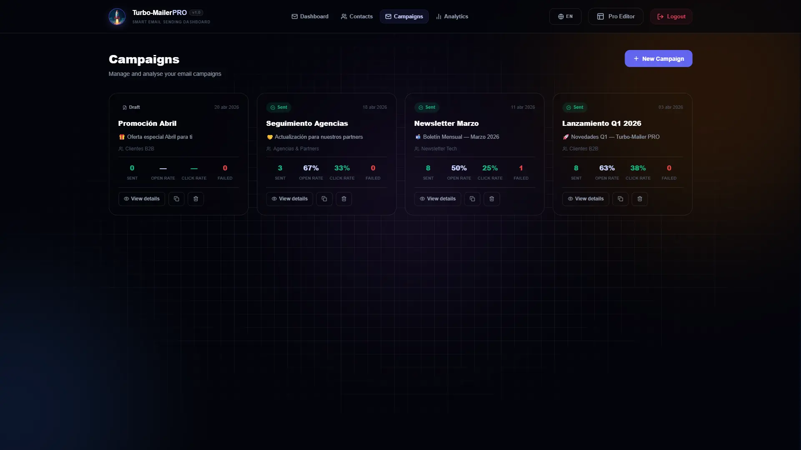
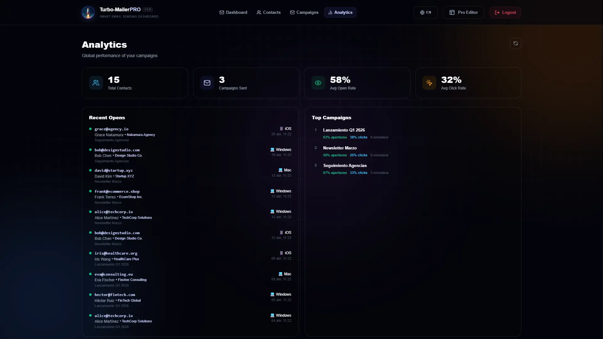

# 🚀 TurboMailer

[](https://www.gnu.org/licenses/agpl-3.0)

**[English version](README.en.md)**

**Plataforma Completa de Email Marketing con CRM simple, Editor de plantillas HTML, IA, Analytics, Tracking y mucho más.**

> ⚠️ **Uso Responsable:** Diseñado para envíos legítimos y con permiso (newsletters, B2B). **Prohibido para spam.** Al usarlo, aceptas las normas de Google y leyes de privacidad (GDPR, etc.) bajo tu propia responsabilidad.

TurboMailer es una aplicación **self-hosted de una sola cuenta diseñada para ser desplegada en un VPS**, ofreciendo una plataforma de email marketing de alto rendimiento construida con **Nuxt 3**. Es una herramienta segura, robusta y con una arquitectura bien planteada para garantizar la soberanía de tus datos. Incluye gestión completa de contactos y listas, editor visual de plantillas HTML con bloques drag & drop, sistema de campañas con tracking de aperturas y clics, analytics en tiempo real, integración con IA para copywriting e interfaz multiidioma (ES/EN). Todo con persistencia real en base de datos SQLite y envío masivo vía cualquier servicio SMTP (Gmail, Outlook, Amazon SES, etc.).

## 🛡️ Tu Información, Solo Tuya (Soberanía de Datos)

Lo que hace a **TurboMailer** una herramienta extremadamente potente es la **privacidad**. Al ser una aplicación auto-alojada en tu propio servidor:

- **Eliminas Intermediarios**: No entregas la información valiosa de tu empresa, negocio o clientes a ninguna plataforma externa.
- **Privacidad Profesional**: Solo existe la conexión directa entre tu instancia privada y tu servicio de correo elegido.


## 📸 Interfaz del Proyecto

<table>
  <tr>
    <td></td>
    <td></td>
  </tr>
  <tr>
    <td></td>
    <td></td>
  </tr>
    <tr>
    <td></td>
    <td></td>
  </tr>
</table>

---

## ✨ Características Principales

### 👥 CRM de Contactos

- Base de datos SQLite autogenerada con **contactos completos**: email, nombre, empresa, teléfono, LinkedIn, URL, YouTube, Instagram, etiquetas (tags) y estado (`activo / dado de baja / rebotado`)
- Gestión de **listas de distribución** con nombre, descripción y color personalizable
- Búsqueda en tiempo real por email, nombre o empresa
- Filtrado por lista y por estado de suscripción
- Paginación (50 por página), selección múltiple y drag-to-list
- **Importación masiva** desde Excel (`.xlsx`, `.xls`, `.csv`) con autodetección de columnas
- **Exportación CSV** de contactos completa
- **Base de datos inteligente**: Autogeneración y sincronización de esquema totalmente automática. No requiere comandos manuales de migración.
- CRUD completo de contactos y listas desde la UI

### 📣 Gestión de Campañas

- Wizard de 4 pasos: nombre + asunto → selección de lista → plantilla → revisión y envío
- Estados de campaña: `borrador / programado / enviando / enviado / pausado`
- Vista de detalle por campaña con listado de destinatarios, sus estados y métricas individuales
- Inyección automática de **pixel de tracking** (apertura) y **enlaces trackeados** (clics) en el HTML antes del envío
- Variables dinámicas (Español/Inglés): `{{Empresa}}`/`{{Company}}`, `{{Nombre}}`/`{{Name}}`, `{{URL}}`, `{{Linkedin}}`, `{{Instagram}}`, `{{Youtube}}`
- Envío masivo vía SMTP con reporte en tiempo real de éxitos y fallos

### 📊 Analytics

- Dashboard con KPIs: total de contactos, campañas enviadas, tasa media de apertura y tasa media de clics
- **Últimas 10 aperturas** con detección de dispositivo (desktop / móvil / tablet)
- **Top campañas** ordenadas por número de aperturas
- Tracking de eventos individuales: opens y clicks registrados con IP, user-agent y timestamp

### 📡 Tracking de Emails

- Pixel 1×1 transparente (GIF) servido por `/api/track/open` — registra apertura e incrementa contador de campaña
- Redirect trackeado en `/api/track/click` — registra clic, incrementa contador y redirige al destino original
- Tabla `trackingEvents` en SQLite con `sendId`, `campaignId`, `contactId`, `eventType`, `url`, `ip`, `userAgent`

### 🔕 Baja de Suscripción

- Enlace de baja personalizado por destinatario en cada correo
- Página `/unsubscribe` con confirmación de baja, estado ya-dado-de-baja y manejo de errores
- Correo de confirmación automático al darse de baja
- Marca el contacto como `unsubscribed` en la base de datos

### 🎨 Editor Visual de Plantillas

- Accesible desde `/editor`
- **Bloques disponibles**: Header, Hero, Card (standard/premium), Botones, Imagen, Texto, Separador, Footer
- Panel de edición: fuente, tamaño, color de texto y fondo, alineación por bloque
- Panel de capas: árbol visual con reordenamiento drag & drop
- **IA por bloque**: mejora el texto de un bloque individual con un clic
- **IA masiva**: mejora todos los bloques de la plantilla a la vez
- **Atajos de teclado**: `Ctrl+S` guardar · `Ctrl+Z` deshacer · `Ctrl+Y` rehacer · `Delete` eliminar bloque
- Autosave al detectar cambios
- **Galería de Plantillas**: biblioteca para guardar, cargar, renombrar y eliminar plantillas HTML propias
- Live Preview con toggle desktop / móvil / modo oscuro

### 🤖 IA Copywriting Assistant

- Integración con OpenAI (GPT-4o-mini configurable a otros modelos de OpenAI)
- Mejora bloques individuales preservando el HTML y las variables dinámicas

### 🌐 Multiidioma (i18n)

- Interfaz completa en **Español** e **Inglés** (i18n)
- Cambio de idioma en tiempo real sin recarga
- Traducción de toda la UI: navegación, pasos, contactos, campañas, analytics, baja de suscripción

### 🧹 Reseteo Selectivo (Mantenimiento)

Desde el Dashboard, el botón de **Reset** abre un visor modal avanzado que permite realizar limpiezas quirúrgicas de los datos:

- **Todo (Reset Agresivo)**: Elimina absolutamente todos los registros de la base de datos y borra físicamente todos los archivos de plantillas HTML creados en `/data/templates`.
- **Solo Base de Datos**: Limpia todos los registros de contactos, listas, campañas, envíos y analíticas, pero preserva tus plantillas de diseño.
- **Reseteo por Módulos**:
  - **Contactos**: Elimina solo la base de datos de contactos y sus listas asociadas.
  - **Campañas**: Borra el historial de campañas y sus reportes de envío.
  - **Analíticas**: Limpia exclusivamente los eventos de tracking (aperturas y clics) para reiniciar métricas.
- **🛡️ Copia de Seguridad Automática**: Antes de ejecutar cualquier proceso de reseteo masivo (Todo o Solo BBDD), el sistema genera automáticamente un archivo `.zip` con el respaldo íntegro de la base de datos y las plantillas. La ruta del backup se muestra en pantalla al finalizar el proceso para tu tranquilidad.

### 🔒 Privacidad y SEO (Anti-Indexación)

Para garantizar la privacidad de tus datos y evitar que la plataforma aparezca en motores de búsqueda, TurboMailer está configurado para **no ser indexado ni cacheado**:

- **No-Index**: Se han incluido etiquetas `meta` (`robots` y `googlebot`) con directivas `noindex` y `nofollow`.
- **Anti-Caché**: Se ha activado la directiva `noarchive` para evitar que Google guarde copias en caché de la interfaz.
- **Robots.txt**: El archivo `robots.txt` bloquea explícitamente el acceso a todos los rastreadores (`User-agent: *`, `Disallow: /`).

---

## 🛠️ Tecnologías

| Área          | Tecnología                                                                     |
| ------------- | ------------------------------------------------------------------------------ |
| Framework     | [Nuxt 3](https://nuxt.com/) — SPA mode (`ssr: false`)                          |
| Base de datos | [SQLite](https://www.sqlite.org/) vía [Drizzle ORM](https://orm.drizzle.team/) |
| Emailing      | [Nodemailer](https://nodemailer.com/) — SMTP (Gmail, Outlook, etc.)            |
| Data Handling | [XLSX (SheetJS)](https://sheetjs.com/)                                         |
| IA            | [OpenAI API](https://platform.openai.com/) — GPT-4o-mini (configurable)        |
| i18n          | [@nuxtjs/i18n](https://i18n.nuxtjs.org/)                                       |
| Icons         | [Lucide Vue Next](https://lucide.dev/)                                         |
| PWA           | `@vite-pwa/nuxt`                                                               |

---

## 🗄️ Base de Datos (Zero-CLI)

TurboMailer gestiona la base de datos de forma **100% automática**.

- **Auto-Instalación**: Al arrancar por primera vez, crea el archivo SQLite y todas las tablas.
- **Auto-Migración**: Si editas el esquema en el código, la app detecta los cambios y actualiza la base de datos al reiniciar.
- **Auto-Recreación**: Si borras el archivo `.db`, la app lo regenera al instante.

SQLite en `./data/turbomailer.db` gestionada con Drizzle ORM. Tablas principales:

| Tabla            | Descripción                                             |
| ---------------- | ------------------------------------------------------- |
| `contacts`       | Contactos con todos sus campos y estado de suscripción  |
| `lists`          | Listas de distribución con nombre, descripción y color  |
| `listContacts`   | Relación M×N contactos ↔ listas (cascade delete)        |
| `campaigns`      | Campañas con estado, contadores y timestamps            |
| `sends`          | Envíos individuales por destinatario con estado y error |
| `trackingEvents` | Eventos de apertura y clic con metadata                 |

---

## 🚀 Flujo de Trabajo

1. **Contactos** — Importa desde Excel o añade manualmente. Organiza en listas con colores.
2. **Campaña** — Crea una campaña en el wizard de 4 pasos: nombre, lista, plantilla, revisión.
3. **Editor** — Diseña tu plantilla en el editor visual o carga una existente de la galería.
4. **Envío** — Previsualiza y envía. El tracking se inyecta automáticamente.
5. **Analytics** — Monitoriza aperturas, clics y rendimiento por campaña en el dashboard.

---

## 🚀 Instalación Rápida

1. **Clonar el repositorio**

   ```bash
   git clone https://github.com/tu-usuario/TurboMailer.git
   cd TurboMailer
   ```

2. **Instalar dependencias**

   ```bash
   npm install
   ```

3. **Configurar el entorno**

   Renombra `.env.template` a `.env` en la raíz del proyecto y completa los campos:

   ```env
   # Acceso a la Aplicación (requerido)
   APP_PASSWORD=tu-contraseña-de-acceso
   PORTAL_KEY=admin

   # Configuración SMTP (requerido para enviar)
   SMTP_HOST=smtp.gmail.com
   SMTP_PORT=465
   SMTP_USER=tu-correo@gmail.com
   SMTP_PASS=tu-password-de-aplicacion
   SMTP_SECURE=true
   SMTP_FROM_NAME=TurboMailer
   SMTP_FROM_EMAIL=tu-correo@gmail.com

   # Inteligencia Artificial (opcional)
   OPENAI_API_KEY=sk-...
   OPENAI_MODEL=gpt-4o-mini

   # Tracking (URL base de la app, para generar pixels y links trackeados)
   TRACKING_BASE_URL=http://localhost:3000
   ```

4. **Iniciar la aplicación**

   ```bash
   npm run dev
   ```

   _No necesitas ejecutar comandos de base de datos o migraciones. La aplicación detectará el esquema y configurará SQLite automáticamente al arrancar._

---

## 🎯 Primer Uso — Base de Datos Demo

Al abrir la app por primera vez (o tras un reset completo), el dashboard detecta automáticamente que la base de datos está vacía y muestra una pantalla de bienvenida con dos opciones:

### Opción A — Cargar datos de ejemplo (Explorar la app)

Pulsa **"Datos de ejemplo"** en el modal de bienvenida. La app copia automáticamente `data/turbomailer_demo.db` sobre `data/turbomailer.db` y recarga la página. Verás de inmediato:

- Contactos y listas de distribución de muestra
- Campañas con estadísticas reales (enviadas, aperturas, clics)
- Eventos de tracking y analíticas pobladas

Esto te permite explorar todas las funciones sin configurar nada. Cuando quieras empezar con tus propios datos, abre el botón **Reset** del dashboard y elige **"Todo (Reset Agresivo)"** — borra todo y vuelve a mostrar la pantalla de bienvenida.

### Opción B — Empezar desde cero

Pulsa **"Empezar desde cero"** para comenzar directamente con la base de datos vacía e importar tus propios contactos.

> **Nota:** `data/turbomailer_demo.db` nunca se elimina. Puedes volver a cargar los datos demo en cualquier momento haciendo un **Reset → Todo** desde el dashboard.

---

## 👻 Seguridad Invisible (Ghost Mode)

Para garantizar la máxima privacidad, TurboMailer está diseñado para ser invisible ante visitantes curiosos o rastreadores.

1. **Raíz de Señuelo**: Al acceder a la raíz del dominio (`/`), se muestra una página de estado técnica simulando un nodo SMTP operativo. El panel de administración está "escondido" en `/dashboard`.
2. **Login Oculto (Backdoor)**: Si intentas entrar a `/login` directamente, la aplicación mostrará un **error 404 falso** (Apache/Ubuntu).
3. **Cómo Acceder**: Debes añadir el parámetro secreto definido en tu archivo `.env` (`PORTAL_KEY`).
   - **URL de acceso**: `tudominio.com/login?portal=admin` (si usas el valor por defecto).

> **Importante**: Una vez que inicies sesión, podrás navegar normalmente por el panel. Si cierras sesión o la sesión expira, volverás a ver la página de señuelo técnica.

## 🔑 Ejemplo: Configuración con Gmail

La app usa Gmail SMTP con una contraseña de aplicación de 16 dígitos (no tu contraseña normal).

1. **Activar Verificación en 2 Pasos**: [Cuenta de Google → Seguridad](https://myaccount.google.com/security)
2. **Generar contraseña**: Accede a [myaccount.google.com/apppasswords](https://myaccount.google.com/apppasswords)
3. Escribe un nombre (ej. `Turbo Mailer`) y haz clic en **Crear**
4. Copia el código de 16 caracteres (sin espacios) y pégalo en `SMTP_PASS`. Asegúrate de que `SMTP_HOST` sea `smtp.gmail.com` y `SMTP_PORT` sea `465`.

---

## 📡 API Reference

### Auth

| Método | Ruta               | Descripción                  |
| ------ | ------------------ | ---------------------------- |
| POST   | `/api/auth/login`  | Login con contraseña maestra |
| GET    | `/api/auth/check`  | Verificar sesión activa      |
| POST   | `/api/auth/logout` | Cerrar sesión                |

### Contactos

| Método | Ruta                   | Descripción                              |
| ------ | ---------------------- | ---------------------------------------- |
| GET    | `/api/contacts`        | Listar con búsqueda, filtro y paginación |
| POST   | `/api/contacts`        | Crear contacto                           |
| GET    | `/api/contacts/[id]`   | Detalle con listas asociadas             |
| PUT    | `/api/contacts/[id]`   | Actualizar campos y tags                 |
| DELETE | `/api/contacts/[id]`   | Eliminar contacto                        |
| POST   | `/api/contacts/import` | Importación masiva desde array           |
| GET    | `/api/contacts/export` | Exportar CSV completo                    |

### Listas

| Método | Ruta                                   | Descripción                         |
| ------ | -------------------------------------- | ----------------------------------- |
| GET    | `/api/lists`                           | Listar con conteo de contactos      |
| POST   | `/api/lists`                           | Crear lista                         |
| PUT    | `/api/lists/[id]`                      | Actualizar nombre/descripción/color |
| DELETE | `/api/lists/[id]`                      | Eliminar lista (cascade)            |
| POST   | `/api/lists/[id]/contacts`             | Añadir contactos en batch           |
| DELETE | `/api/lists/[id]/contacts/[contactId]` | Quitar contacto de lista            |

### Campañas

| Método | Ruta                        | Descripción                         |
| ------ | --------------------------- | ----------------------------------- |
| GET    | `/api/campaigns`            | Listar campañas (filtro por estado) |
| POST   | `/api/campaigns`            | Crear borrador                      |
| GET    | `/api/campaigns/[id]`       | Detalle con métricas                |
| PUT    | `/api/campaigns/[id]`       | Actualizar campaña                  |
| DELETE | `/api/campaigns/[id]`       | Eliminar campaña                    |
| POST   | `/api/campaigns/[id]/send`  | Lanzar envío                        |
| GET    | `/api/campaigns/[id]/sends` | Listado de envíos individuales      |

### Tracking & Analytics

| Método | Ruta               | Descripción                 |
| ------ | ------------------ | --------------------------- |
| GET    | `/api/track/open`  | Pixel de apertura (GIF 1×1) |
| GET    | `/api/track/click` | Redirect trackeado          |
| GET    | `/api/analytics`   | KPIs del dashboard          |
| GET    | `/api/unsubscribe` | Baja de suscripción         |
| DELETE | `/api/reset`       | Reseteo selectivo de datos  |

---

- **Privacy**: Contact and campaign data persist in your local SQLite database. Your data **never** leaves your server and is not accessible by third parties.
- **Ghost Mode**: High-level obfuscation (see the Ghost Mode section above for access details).

---

## 📄 Plantillas de Demo

Encuentra una plantilla de ejemplo profesional en: `data/demo/email_demo.html`
También dispones de dos listas de contactos para pruebas: `data/demo/contacts_demo.csv` y `data/demo/contacts_demo.xlsx`.

---

## 📝 ToDo / Pendiente

- [x] **Campañas** — Revisar funcionalidades completas (wizard, envío, estados, tracking inyectado). Funcional y testeado básicamente, pero requiere testing en profundidad.
- [x] **Contactos** — Revisar CRUD, importación Excel, exportación CSV, drag-to-list, paginación y filtros. Funcional y testeado básicamente, pero requiere testing en profundidad.
- [x] **Analíticas** — Revisar KPIs, últimas aperturas, top campañas y eventos de tracking. Funcional y testeado básicamente, pero requiere testing en profundidad.
- [x] **Internacionalizar Editor** — Falta internacionalizar el visor de editor (actualmente solo en español).
- [ ] **Editor Responsive** — Es complejo y no muy útil en móvil porque tiene muchas opciones, realmente el editor está diseñado para usarlo en escritorio.

---

## ⚖️ License

This project is licensed under the **GNU Affero General Public License v3.0 (AGPL-3.0)**.

### 🔑 Key Requirements

- **Copyleft**: Any modifications must be released under the same license.
- **Network Interaction**: If you run a modified version as a service (SaaS), you **must** provide the source code to your users.
- **Commercial Use**: Free for personal and open-source projects. For commercial use without opening your source code, a **private commercial license** is required.

For commercial licensing inquiries, please contact me

---

## ⚖️ Aviso Legal

Este proyecto es una herramienta de desarrollo. El uso indebido para comunicaciones no solicitadas (SPAM) está prohibido. Asegúrate de cumplir con las normativas locales (GDPR, CAN-SPAM Act, LSSI-CE) antes de realizar envíos masivos.

---

**Desarrollado con ❤️ por Crazyramirez mientras me zampo tropecientos podcasts en Youtube de fondo.**
